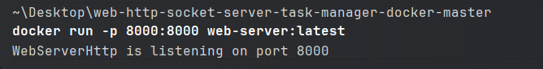
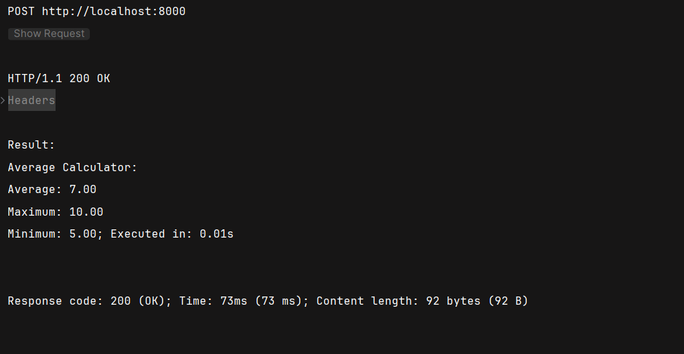
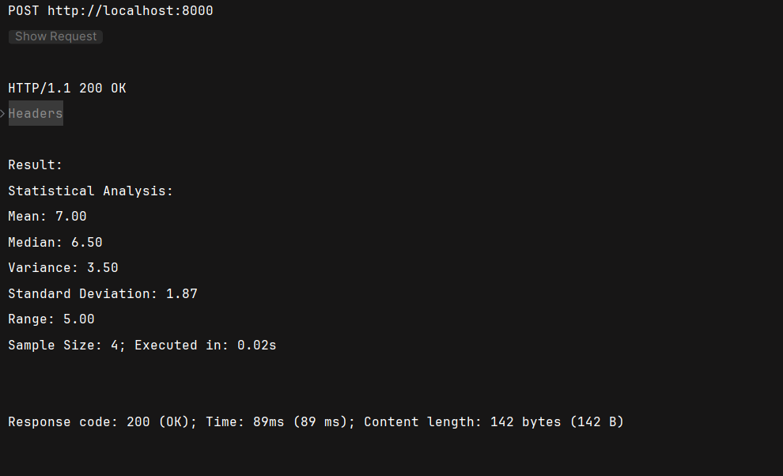
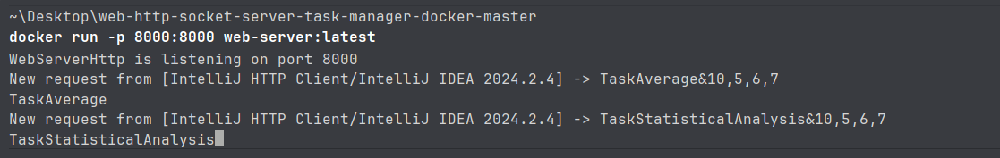

# Multi-threaded WebServers tasks executor using WebHttpServer and WebServerSocket

This project aims to create two kinds of multi-threaded web servers (with thread-pooling) for executing simple tasks.
There are three tasks implemented and the user can add more (see details below).
The web servers receive the command and the parameter(s) for running a task through terminal command `curl`.

_P.S. There is another project where I used *ServerSocker* in GitHub: [localhost-chat-socket](https://github.com/wagnerjfr/localhost-chat-socket)_

## Full article
### [Unveiling Two Dynamic Multi-Threaded Web Servers for Task Execution](https://levelup.gitconnected.com/unveiling-two-dynamic-multi-threaded-web-servers-for-task-execution-62644e78a04a)
_Different Type of Web Serves Using HttpServer and ServerSocket_

## WebServers
* **WebServerHttp** is developed using *HttpServer* [[javadoc](https://docs.oracle.com/javase/8/docs/jre/api/net/httpserver/spec/com/sun/net/httpserver/HttpServer.html)].

* **WebServerSocket** is developed using *ServerSocket* [[javadoc](https://docs.oracle.com/javase/8/docs/api/java/net/ServerSocket.html)].

Both web servers use *ExecutorService* [[javadoc](https://docs.oracle.com/javase/8/docs/api/java/util/concurrent/ExecutorService.html)] that executes each submitted task in the pooled thread, more specifically, `Executors.newCachedThreadPool()` which is an unbounded thread pool with automatic thread reclamation [[javadoc](https://docs.oracle.com/javase/8/docs/api/java/util/concurrent/Executors.html#newCachedThreadPool--)].

## New Tasks

### 1. Average Calculator
The Average Calculator task processes a comma-separated list of numbers and returns:
- Average value
- Maximum value
- Minimum value

Example usage:
```bash
 curl -X POST -d "TaskAverage&10,7,9,4" "http://localhost:8000"
```
### 2. Statistical Analysis
The Statistical Analysis task provides comprehensive statistical metrics for a given set of numbers including:
- Mean
- Median
- Variance
- Standard Deviation
- Range
- Sample Size

Example usage:
```bash
 curl -X POST -d "TaskStatisticalAnalysis&10,7,9,4" "http://localhost:8000"
```
**📝 Note:**  
There are other tasks already implemented in the project.
There are two http-request files in the project:
- Average-api.http and Statistical-api.http
If you want to test the web servers, use the files instead of the curl command.


⚠️ **Important Note:**  
I have modified the docker file for fun but when I make a requests to the container I realized that the `WebServerSocket`
it uses http version 0.9 and the `WebServerHttp` uses http version 1.1.

## Running with Docker
After you build the image, you can run the container with the following command:
```bash
docker run -p 8000:8000 web-server:latest
```

## Project Screenshots

### Directory Structure
The project's images are stored in the `resources/images/` directory from the main directory.

### Available Screenshots

#### Web Server Execution


#### Task Outputs

*Average calculator task execution with sample input*


*Statistical analysis task showing its calculated metrics*

#### Server Logs

*Server logs showing the execution of the tasks*

## JAR File Execution

### Building the JAR
Build the project JAR file using Maven:
```bash
mvn clean package
```
### Running the JAR
Execute the generated JAR file from the target directory:
```bash
java -jar target/Web-Server-1.0-Final.jar
```

